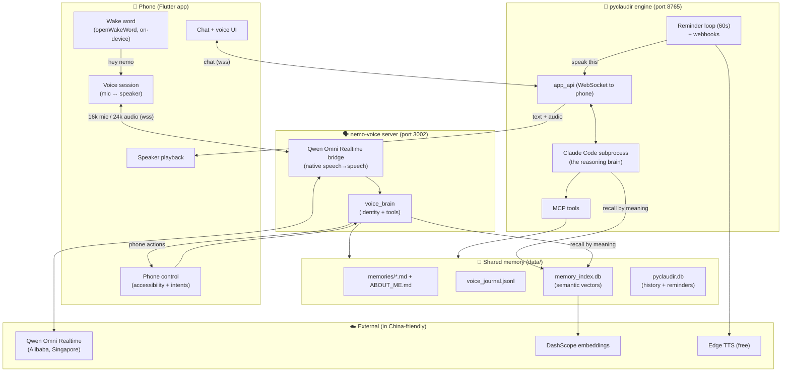
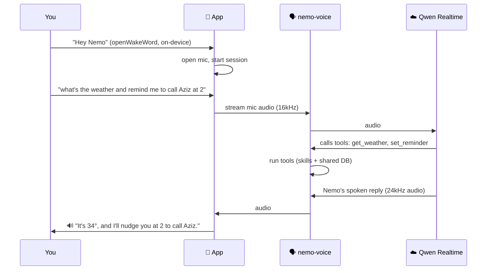
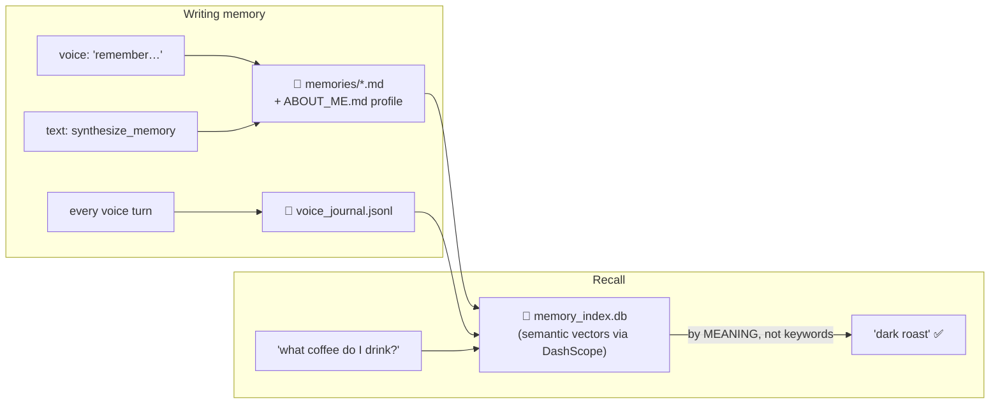
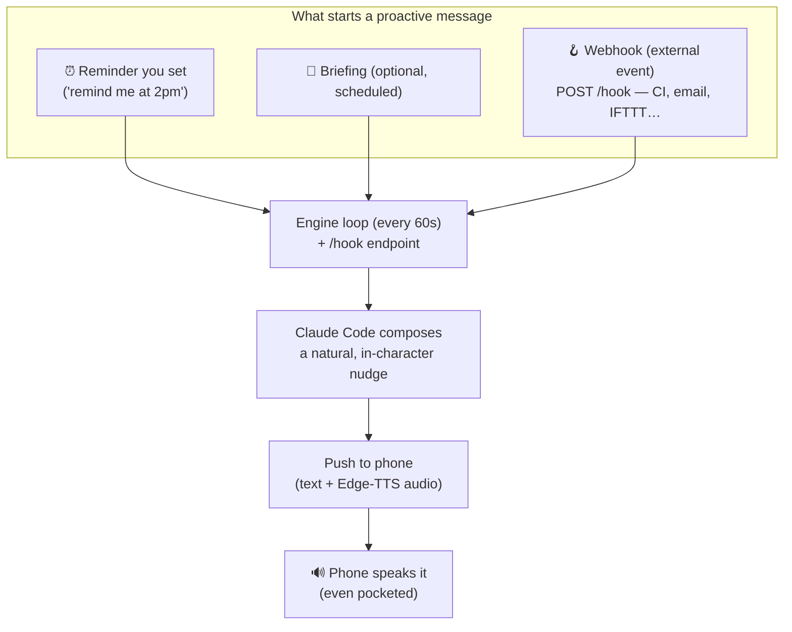

# How Nemo Works — Architecture Overview

Nemo is a private, proactive voice assistant for Avazbek — a "Jarvis" that lives
on the phone, remembers everything across conversations, can act on the phone,
and reaches out *first* (reminders, briefings, alerts) instead of only answering.

It runs as **three cooperating pieces**: the phone app, a realtime voice server,
and the "brain" engine. Everything below is how they fit together.

---

## 1. The big picture



**One-line summary of each piece:**
- **Phone app** — what you see/talk to. Hears "hey nemo", runs the live voice
  call, drives the phone, plays Nemo's voice.
- **nemo-voice** — the realtime voice layer. Streams your mic to Qwen's native
  speech-to-speech model and streams Nemo's voice back.
- **engine (pyclaudir)** — the brain + the proactive scheduler. Runs Claude Code,
  owns memory and reminders, and pushes things to the phone on its own.

---

## 2. Voice — how a conversation flows

Nemo's voice is **native speech-to-speech** (audio in → audio out, one model —
the same idea as Google's Gemini Live, but it works in China). There's no
separate "speech-to-text then text-to-speech"; that's why it's fast and natural.



- **Wake word** is fully on-device (no audio ever leaves the phone) — a tiny
  ONNX keyword model ("hey nemo"), not a heavy transcriber.
- **The mic is half-duplexed** — muted while Nemo speaks so his own voice can't
  cut him off, then reopened the instant he finishes.

---

## 3. Memory — how Nemo "knows" you

Memory is **shared** between the voice Nemo and the text/engine Nemo, so anything
you tell one, the other knows.



Three layers:
1. **Facts** (`memories/*.md`, `ABOUT_ME.md`) — curated, durable. Written when
   you tell Nemo something worth keeping.
2. **Journal** (`voice_journal.jsonl`) — every spoken turn, so nothing is lost.
3. **Semantic index** (`memory_index.db`) — embeds it all so recall works by
   *meaning* ("what do I drive?" → "has a Tesla"), not just keyword match. Both
   brains read the same index. Degrades to keyword search if offline.

A nightly self-reflection + weekly consolidation keep the memory tidy and refresh
your profile automatically.

---

## 4. Proactive — Nemo reaching out first

This is what makes Nemo a "Jarvis" and not just a Q&A bot. The engine runs a
loop and can **speak to you on its own**.



- **Reminders** — you set them by voice or text; they fire and *speak*.
- **Briefings** — opt-in morning/evening summaries (off by default, you control
  them).
- **Webhooks** — point any external service at a private URL and Nemo tells you,
  in his voice. ("Heads up, your build failed — want me to look?")
- A background service keeps the app alive so these arrive even when pocketed.

---

## 5. What Nemo can do (capabilities)

| Area | What it does |
|---|---|
| 🗣️ **Talk** | Natural voice chat; understands English/Russian/Uzbek (mixed), replies in English |
| 📞 **Phone control** | Open any app, set alarms/timers, message a contact on Telegram, tap/type/swipe |
| ⏰ **Scheduling** | "Remind me at 2pm…" → fires + speaks; list/cancel; optional briefings |
| 🔎 **Web search** | Looks things up live (DuckDuckGo) and reads the answer back |
| 🌤️ **Skills** | Drop-in `SKILL.md` capabilities (weather today; add more with no code) |
| 🧠 **Memory** | Remembers facts + conversations, recalls by meaning, shared across voice & text |
| 🔔 **Proactive** | Speaks first: reminders, briefings, external alerts |

---

## 6. Privacy & security (built in)

- **App-only** — no Telegram dependency; the phone (and later desktop) is the
  only interface. The wake word and all audio capture are **on-device**.
- **Read-gating** — Nemo can *never* read your screen, messages, or camera on its
  own or during a reminder. Only when you explicitly ask, in that moment.
- **Sensitive actions** (camera, typing) are behind a biometric gate.
- **Encrypted transport** — the phone talks to the server over TLS with a pinned
  certificate; app updates are signature- + hash-verified.

---

## 7. Where things live (for the curious)

```
nemo-app/            Flutter app  (UI, voice session, wake word, phone control)
  android/.../WakeWordController.kt   on-device openWakeWord (ONNX)
  lib/services/                       voice_session, nemo_service, phone_command…
nemo-voice/server/   Realtime voice  (Qwen Omni Realtime bridge)
  qwen_realtime.py   the speech↔speech bridge
  voice_brain.py     Nemo's identity + tool routing
  memory_index.py    semantic recall   |  reminders.py  |  skills/  (weather, web_search)
pyclaudir/           The engine / brain
  app_api.py         WebSocket to the phone + /hook webhook
  __main__.py        startup + the 60s reminder loop
  semantic_memory.py engine-side recall  |  tools/  (phone_action, reminders, search…)
data/                Shared memory (memories, journal, index, db) — the single source of truth
```

> Nemo is built in layers: a fast realtime voice on top, a reasoning brain
> underneath, one shared memory in the middle, and a proactive loop that lets him
> speak first. Each piece is small and swappable — the voice model, the wake
> word, and individual skills can all change without touching the rest.
